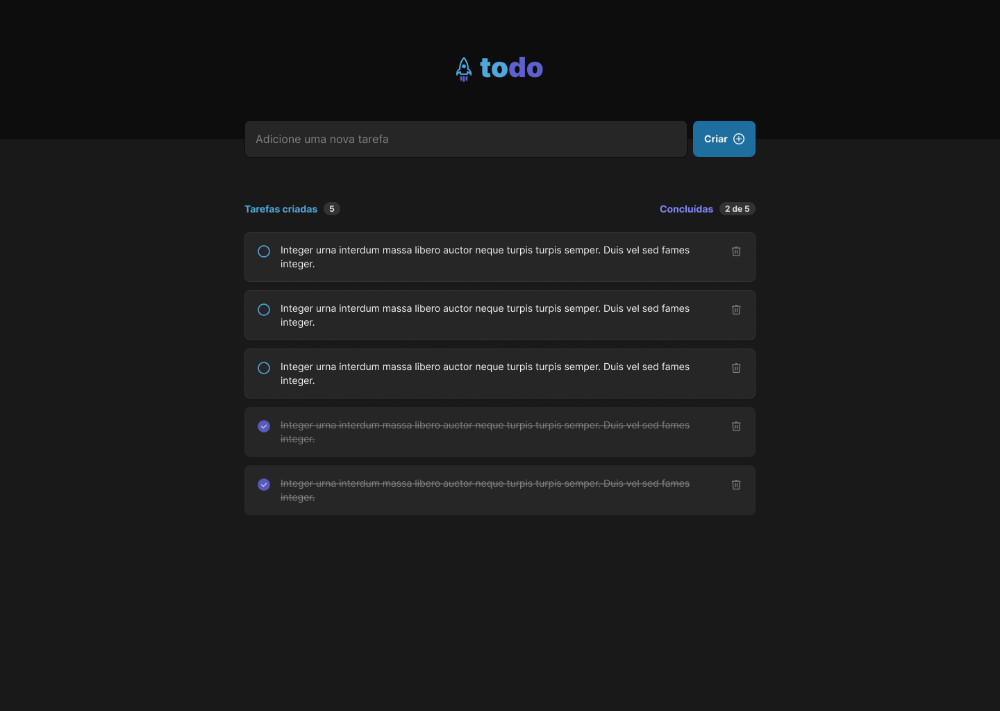

# ToDo List 

Meu 1° desafio na trilha atualizada de **ReactJs** do curso da ignite na rocketseat.
Nesse projeto aproveitei para colocar em prática algumas coisas na qual eu ja venho treinando 
a algum tempo como: 

- [x] Styled-components 
- [x] Aos 
- [x] Flatlist

	
	

